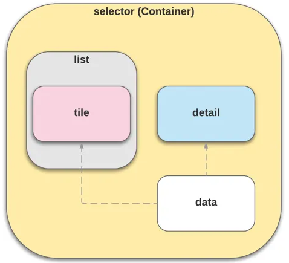

Source for projects in the [Build LWC](https://trailhead.salesforce.com/en/content/learn/trails/build-lightning-web-components) trail.

# Component Hierarchy

This Component Heirarchy relates to the module on [Handling events in LWC](https://trailhead.salesforce.com/en/content/learn/modules/lightning-web-components-basics/handle-events-in-lightning-web-components?trail_id=build-lightning-web-components) and is for the components of the same name as labeled in the image below.

